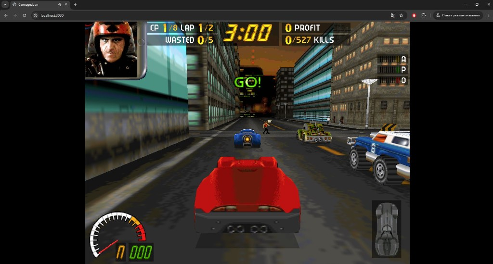

# Carmageddon — Web Port

Play **Carmageddon** (1997) in your browser. This project compiles the open-source [Dethrace](https://github.com/dethrace-labs/dethrace) engine to **WebAssembly** with **WebGL 2** rendering and **Web Audio** sound.

**[Play live demo in browser →](https://retrogamescenter.ru/ports/carmaweb/index.html)**



---

## Features

- Full single-player Carmageddon experience in a modern browser
- OpenGL renderer via Emscripten + BRender
- Menu, races, opponents, pedestrians, power-ups, replays
- Save games stored in the browser (IndexedDB via Emscripten IDBFS)
- Keyboard + mouse controls
- No install — static hosting only (HTML + WASM + preloaded data)

---

## How it works

```
┌─────────────────────────────────────────────────────────────┐
│  Browser                                                    │
│  ┌──────────────┐   ┌─────────────┐   ┌──────────────────┐  │
│  │ index.html   │──▶│ carmaweb.js │──▶│ carmaweb.wasm    │  │
│  │ + pre.js     │   │ (Emscripten │   │ (Dethrace engine │  │
│  └──────────────┘   │  glue)      │   │  + BRender GL)   │  │
│                     └─────────────┘   └────────┬─────────┘  │
│  ┌──────────────┐   WebGL 2 canvas ◀───────────┘            │
│  │ carmaweb.data│   (game files preloaded to /carma)         │
│  └──────────────┘                                           │
│  ┌──────────────┐   /persistent → IDBFS (save games)        │
│  │ IndexedDB    │                                           │
│  └──────────────┘                                           │
└─────────────────────────────────────────────────────────────┘
```

1. **Build** — [Dethrace 0.10.1](dethrace-0.10.1/) is cross-compiled with **Emscripten** to `carmaweb.wasm` + `carmaweb.js`.
2. **Game data** — Retail `DATA/` (and related files) are embedded at link time as `carmaweb.data` (~190 MB) and mounted at `/carma` in the virtual filesystem.
3. **Rendering** — BRender’s OpenGL backend draws to an HTML5 canvas. Frame pacing uses Asyncify only during **in-race** presentation to avoid WebGL flicker; the menu swaps without extra yields.
4. **Audio** — [miniaudio](https://github.com/mackron/miniaudio) drives Web Audio (ScriptProcessor). A user click/key press is required once to unlock `AudioContext` (browser policy).
5. **Saves** — Only `/persistent` uses IDBFS; game data is read-only from the preload pack.

### Web-specific patches (summary)

| Area | Approach |
|------|----------|
| Race rendering | Single `emscripten_sleep` per frame in `SDL2_Harness_Swap` only while racing |
| Menu / UI | No Asyncify between frames — stable menus, no flicker |
| Menu audio | `SoundService()` during interface loop; input waits yield with `emscripten_sleep(0)` |
| ESC → pause menu | `WaitForNoKeys()` yields so key-up events are processed |
| PIX duplicates (web) | Material colour-map refresh for duplicate pixelmaps |

---

## Quick start (play locally)

You need a **legal copy** of Carmageddon on disk (not included here).

### Requirements

- [Emscripten SDK](https://emscripten.org/docs/getting_started/downloads.html) 3.1+
- CMake 3.20+, Ninja
- Python 3 (for local server)
- ~2 GB free disk space for build + data pack

### 1. Add game data

```
carmagit/
  Carma/          ← your install root (name matters for default CMake path)
    DATA/
    MUSIC/
    ...
```

The build expects `Carma/DATA/GENERAL.TXT` to exist.

### 2. Build

**Windows (PowerShell):**

```powershell
.\scripts\build-emscripten.ps1
```

**Linux / macOS:**

```bash
source ~/emsdk/emsdk_env.sh
chmod +x scripts/build-emscripten.sh
./scripts/build-emscripten.sh
```

This produces `web/carmaweb.js`, `web/carmaweb.wasm`, and `web/carmaweb.data`.

### 3. Run

```bash
python web/serve.py
```

Open **http://localhost:8080** — hard-refresh with **Ctrl+Shift+R** after rebuilds.

Click the page or press a key once if audio is silent.

---

## Deploying to static hosting

Upload the contents of `web/` after a successful build:

| File | Purpose |
|------|---------|
| `index.html` | Page shell |
| `pre.js` | WebGL + IDBFS + audio unlock hooks |
| `carmaweb.js` | Emscripten loader |
| `carmaweb.wasm` | Game engine |
| `carmaweb.data` | Preloaded game assets |

Configure your host to serve **large files** (200 MB+) and **correct MIME types** (`application/wasm` for `.wasm`).

> **Note:** Do not commit `carmaweb.data` or retail game files to a public GitHub repo unless you have explicit rights. Use Git LFS or host binaries separately (as on the [live demo](https://retrogamescenter.ru/ports/carmaweb/index.html)).

---

## Controls (default keyboard)

| Action | Key |
|--------|-----|
| Accelerate | ↑ |
| Brake / reverse | ↓ |
| Steer | ← / → |
| Handbrake | Space |
| Camera | C |
| Repair | Backspace |
| Pause / menu (in race) | Esc |
| Horn | H |

Mouse works in menus. In-race camera look uses **WASD** (patched in `pre.js` / input layer).

---

## Project layout

```
carmagit/
├── README.md              ← you are here
├── NOTICE.md              ← game asset copyright
├── .gitignore
├── docs/
│   └── screenshot.png
├── dethrace-0.10.1/       ← engine source (Dethrace + web patches)
├── web/
│   ├── index.html         ← browser entry point
│   ├── pre.js             ← Emscripten pre-load hooks
│   └── serve.py           ← dev server (no cache)
├── scripts/
│   ├── build-emscripten.ps1
│   └── build-emscripten.sh
└── cmake/
    └── Emscripten.cmake
```

---

## Browser support

Tested on recent **Chrome**, **Edge**, and **Firefox**.

- WebGL 2 required
- WebAssembly required
- ~200 MB download on first load (game data pack)
- Recommended: desktop, hardware keyboard

---

## Credits & license

| Component | License / source |
|-----------|------------------|
| [Dethrace](https://github.com/dethrace-labs/dethrace) | GPL-3.0 — see [dethrace-0.10.1/LICENSE](dethrace-0.10.1/LICENSE) |
| BRender, miniaudio, stb, etc. | See respective files under `dethrace-0.10.1/lib/` |
| **Carmageddon game data** | **Not included** — commercial / rights-holder property |

This web port is a community technical project. It is **not** affiliated with or endorsed by Stainless Games or current rights holders.

---

## Contributing

PRs welcome for web-specific fixes. Please do **not** submit copyrighted game assets.

When changing Emscripten link flags or the main loop timing, test **both** in-race driving (no jitter) and menu navigation (no flicker, no audio dropouts).
